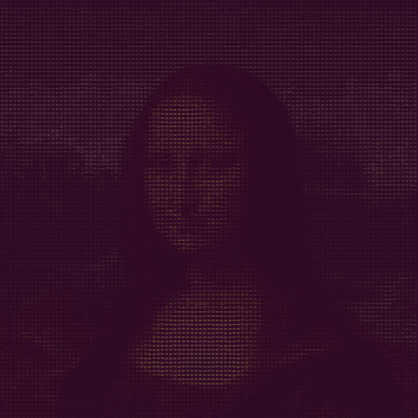

# asciify

Turn images and webcam video to ASCII art. Examples are in the `ascii/` folder.

### Interactive Site

https://asciiart.herokuapp.com/

Users can upload their own images or try out default ones.


To run locally:
```
$ pip3 install -r requirements.txt
$ python3 wsgi.py
``` 

Then visit `http://localhost:5000`.

---

### Webcam

Converts webcam video to ASCII art in real time.


To run:

```
$ pip3 install -r requirements.txt
$ python3 webcam.py
``` 

This will open up a webcam window. 

Then open up a new terminal tab and run:

`$ watch -n 0.1 cat asciiart.txt`

to see the webcam video as ASCII art in real time. Zoom out of the terminal tab until the image is clear.

---

### Picture

Convert pictures to coloured ASCII art.

| Original | Coloured ASCII | Black & White ASCII |
| --- | --- | --- |
|  |  |  |

To run:

```
$ pip3 install -r requirements.txt
$ python3 picture.py
``` 

Then enter the image path. This will print out the coloured ASCII art. Zoom out of the terminal tab until the image is clear.
